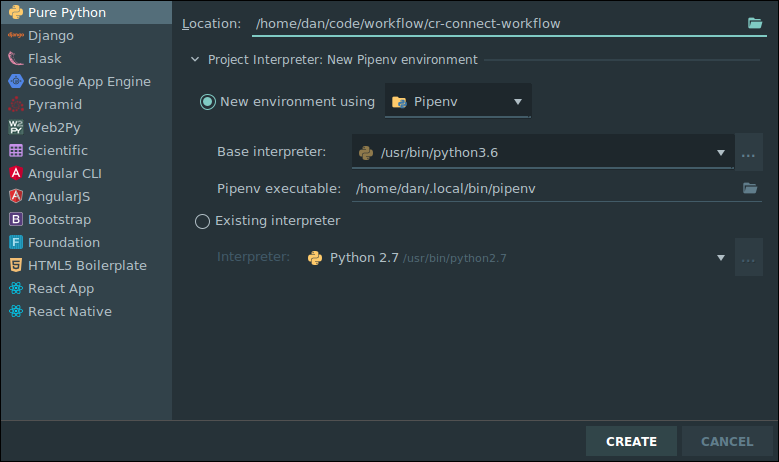
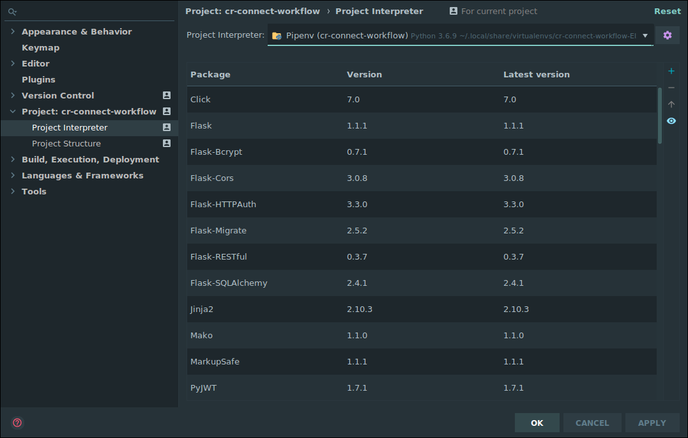
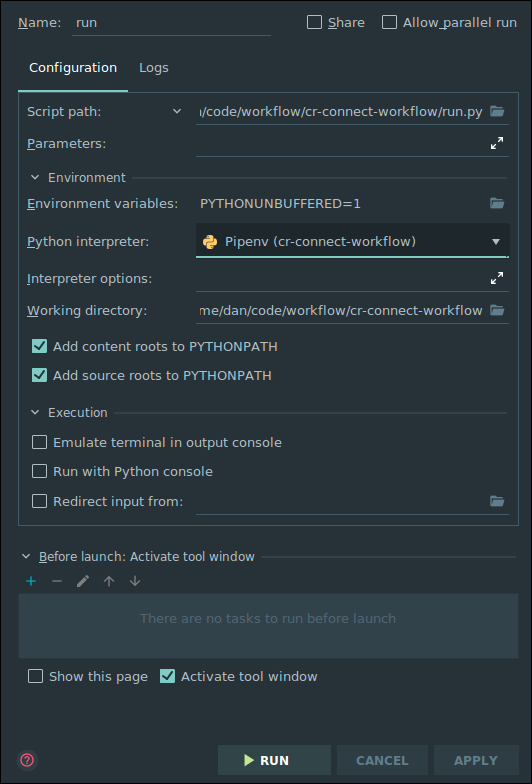

# sartography/cr-connect-workflow

[](https://travis-ci.com/sartography/cr-connect-workflow)

# CR Connect Workflow Microservice
## Development Setup
### Tools
These instructions assume you're using these development and tools:
- IDE: PyCharm Professional Edition
- Operating System: Ubuntu 

### Environment Setup
Make sure all of the following are properly installed on your system:
1. `python3` & `pip3`:
    - [Install python3 & pip3 on Linux](https://www.digitalocean.com/community/tutorials/how-to-install-python-3-and-set-up-a-programming-environment-on-an-ubuntu-18-04-server)
    - [Installing Python 3 on Linux](https://docs.python-guide.org/starting/install3/linux/)
    - For windows, install Python 3.8 from Mircosoft Store, which comes with pip3
2. `pipenv`:
    - From a terminal or Powershell, 'pip install pipenv'
    - For windows, make note of the location where the pipenv.exe is placed, it will tell you in the output.  For me
      it was C:\Users\danie\AppData\Local\Packages\PythonSoftwareFoundation.Python.3.8_qbz5n2kfra8p0\LocalCache\local-packages\Python38\Scripts\pipenv.exe
    - [Install pipenv](https://pipenv-es.readthedocs.io/es/stable/)
    - [For Linux: Add ${HOME}/.local/bin to your PATH](https://github.com/pypa/pipenv/issues/2122#issue-319600584)
     
3. `install depdencies`
    - pipenv install 
    - pipenv install --dev    (for development dependencies)

### Running Postgres
We use a docker container to run postgres, making it easier to get running
locally (at least for linux) Docker containers on windows are alitt
trickly, so see detailed directions below ...

#### Linux 
1. There is a sub-directory called "postgres" that contains a docker-compose script.

#### Windows
You will need to install Docker (and Docker Compose which comes with this) installed. See:
https://docs.docker.com/compose/install/  I had good success using Docker Desktop to 
fire up the docker container.

Once you have Docker installed for windows, you will need to enable resource file sharing
(go the Docker / Settings / Resources / Filesharing and enable File shareing for the full C:/ 
drive.  

Due to some permission issues with Docker, you need to create a shared docker volume.
On the command line, cd into your postges directory, and run the following:
```
docker volume create --name=data
```

Finally, you can use docker compose to build the docker instance
```
docker-compose -f docker-windows-compose.yml up --no-start
```
Assuming you have docker and docker-compose installed correctly, and you fixed the permission
issues as described above, these should execute without error.
At which point you can open up the Docker Desktop Dashboard and see postgres now exists
as a docker container.  Hit play, and it should show that it is running.  Congratulations!
Postgres is running.  

When you come back to this later, you may need to start the docker container again, but
it should always be visible in the Docker Desktop Daskboard with a friendly little play
stop button for your clicking pleasure.


### Environment Setup Part #2
If you want to run CR-Connect in development mode you must have the following two services running:
1. `Postgres Docker`:  There is a sub-directory called Postgres that contains a docker image that will set up an empty
database for CR-Connect, and for Protocol Builder Mock, mentioned below.  For must systems, you can 'cd' into this
directory and just run start.sh to fire up the Postgres service, and stop.sh to shut it back down again.
create .env file in /postgres with the following two lines in it:
```
DB_USER=crc_user
DB_PASS=crc_pass
```
With this in place, from the command line:
```bash
cd postgres
./start.sh
```
You can now build the database structure in the newly created database with the following lines
```baseh
cd ..  (into base directory)
flask db upgrade
flask load-example-data (this creates some basic workflows for you to use)
```

2. `Protocol Builder Mock`: We created a mock of the Protocol Builder, a critical service at UVA that is a deep
dependency for CR-Connect.  You can find the details here: [Protocol Builder Mock](https://github.com/sartography/protocol-builder-mock)
Be sure this is up and running on Port 5002 or you will encounter errors when the system starts up.

With Protocol Builder Mock up and running, visit http://localhost:5001 and create a study.  Set the user
and primary investigator to dhf8r - which is a user in the mock ldap service, and this will later show up when you
fire up the interface.

### Configuration
This covers both local configurations for development, and production settings.
We will cover all the settings below, but perhaps the most important part of the configuration is setting
the location of your workflow specifications.  If you start up without setting a path, then it will
use a few testing workflows as a default.  

For CRConnect, there is a private repository that contains all the workflow specifications, so get this
checked out, then in a file called /instance/config.py add the following setting:
SYNC_FILE_ROOT = '/path/to/my/git/dir/crconnect-workflow-specs'

#### Local Configuration
`instance/config.py`: This will configure the application for your local instance, overriding the configuration
in config/default.  Very handy for setting 

#### Production Configuration
We use environment variables with identical names to the variables in the default configuration file to configure the
application for production deplyment in a docker container

#### Common Configuration Settings
While these can be set in instance/config.py or as environment settings in docker, I'll present this as how you would
define the Docker Container, as /config/default.py offers a good example of the former.
```yaml
  cr-connect-backend-testing:
    container_name: cr-connect-backend-testing 
    image: ghcr.io/sartography/cr-connect-workflow:master  # We use GitHub's actions to publish images
    volumes:
      - /home/sartography/docker-volumes/testing:/var/lib/cr-connect/specs   # where specs are located.
    ports:
    environment:
      - PRODUCTION=true   # Should be set to true if you aren't running locally for development.
      - DEVELOPMENT=false # Should be the opposite of production.
      - PB_ENABLED=true   # Generally true, we should connect to Protocol Builder
      - PREFERRED_URL_SCHEME=https   # Generally you want to run on SSL, should be https 
      - SERVER_NAME=testing.crconnect.uvadcos.io  # The url used to access this app.
      - INSTANCE_NAME=testing  # This is the informal name of the server, used in BPMN documents
      - TOKEN_AUTH_SECRET_KEY=-0-0-0- TESTING SUPER SECURE -0-0-0- # Some random characters that seed our key gen.
      - APPLICATION_ROOT=/api # Appended to SERVER_NAME, is the full path to this service
      - ADMIN_UIDS=dhf8r,cah3us  # A comma delimited list of people who can preform administrative tasks.
      - CORS_ALLOW_ORIGINS=testing.crconnect.uvadcos.io,shibidp.its.virginia.edu,sp.uvadcos.io # CORS stuff
      - FRONTEND=testing.crconnect.uvadcos.io # URL to reach the front end application.
      - BPMN=testing.crconnect.uvadcos.io/bpmn # URL to reach the configuration interface.
      - PB_BASE_URL=http://10.250.124.174:11022/pb/v2.0/ # URL for Protocol Builder
      - UPGRADE_DB=true # Will run all migrations on startup if set to true.  Generally a good idea for production.
      - DB_USER=crc_user # Database user name
      - DB_NAME=crc_testing  # Database passwprd
      - DB_HOST=10.250.124.186 # Domain/IP of database server.
      - DB_PORT=15432 # Port of database server.
      - DB_PASSWORD=XXXXX  # Passwword for the database
      - MAIL_PASSWORD=XXXX  # Mail Password
      - MAIL_USERNAME=XXXXX # Mail username
      - LDAP_URL=privopenldap.its.virginia.edu # URL for the LDAP Server
      - LDAP_PASS=XXXX # Password for the ldap server
      - LDAP_USER=cn=crcconnect,ou=Special Users,o=University of Virginia,c=US #LDAP settings for search, likely these.
      - SENTRY_ENVIRONMENT=testing.crconnect.uvadcos.io # Configuration for Sentry
      - GITHUB_TOKEN=XXXX # A token for GitHub so we can push and pull changes.
      - PORT0=11021  # The port on the server where this sytem should be avialable,  could be 80, but we are behind a proxy.
      - SYNC_FILE_ROOT=/var/lib/cr-connect/specs # This should be the same as the volumes above, a location where the specs are checked out in git.
```


### Project Initialization
1. Clone this repository.
2. In PyCharm:
    - Go to `File > New Project...`
    - Click `Pure Python` (NOT `Flask`!!)
    - Click the folder icon in the `Location` field.
    - Select the directory where you cloned this repository and click `Ok`.
    - Expand the `Project Interpreter` section.
    - Select the `New environment using` radio button and choose `Pipenv` in the dropdown.
    - Under `Base interpreter`, select `Python 3.7`
    - In the `Pipenv executable` field, enter `/home/your_username_goes_here/.local/bin/pipenv` 
    - Click `Create`
        
3. PyCharm should automatically install the necessary packages via `pipenv`. 
For me, the project interpreter did not set set up for me correctly on first attempt.  I had to go
to File -> Settings -> Project Interpreter and again set the project to use the correct PipEnv 
environment. Be sure that your settings like simliar to this, or attempt to add the interpreter again
by clicking on the gear icon.
 

4. With this properly setup for the project, you can now right click on the run.py and set up a new 
run configuration and set up a run configuration that looks like the following (be sure to save this 
run configuration so it doesn't go away.) :


### Running the Web API
Just click the "Play" button next to RUN in the top right corner of the screen.
The Swagger based view of the API will be avialable at http://0.0.0.0:5000/v1.0/ui/

### Running Tests
We use pytest to execute tests.  You can run this from the command line with:
```
pipenv run coverage run -m pytest
```
To run the tests within PyCharm set up a run configuration using pytest (Go to Run, configurations, click the
plus icon, select Python Tests, and under this select pytest, defaults should work good-a-plenty with no
additional edits required.) 


## Documentation
Additional Documentation is available on [ReadTheDocs](https://cr-connect-workflow.readthedocs.io/en/latest/#)

## Manual Synch
You can move all the BPMN diagrams from one system to another (upgrading and replacing as needed)  This is how
we will transfer files from staging to production. 
Eventually we will connect this into the front end code for the BPMN Editor, but for now, you can do so by:

1. Run flask clear-db to clear out your local database if desried (this isn't reuired, but will give you a clean slate 
to get an exact replica of production/testing whatever)

2. Log into the Swagger UI for the system you want to move all files to (this could be a local development machine)

3. Set the API Token under authentication.  This token must match what is on the testing server.  This might
match what is in the default config, at least, that will work for staging.

4. Run the workflow_synch/pullall in swagger, using the url for the site you want to pull from:
   something like "https://testing.crconnect.uvadcos.io/api"

5. Be patient.  It may take a minute or more to pull everything down.


### Additional Reading

1. [BPMN](https://www.process.st/bpmn-tutorial/)  Is the tool we are using to create diagrams
of our business processes.  It's is a beautiful concise diagramming tool. We strongly recommend you 
read this complete tutorial, as this notation is the foundation on which this project as well as many
other software systems for businesses are built.  Know it well.

### Notes on Creating Good BPMN Diagrams in Comunda
1. Be sure to give each task a thoughtful (but unique!) id. This will 
make the command line and debugging far far easier.  I've tended to pre-fix
these, so task_ask_riddle if a task is asking a riddle for instance.
